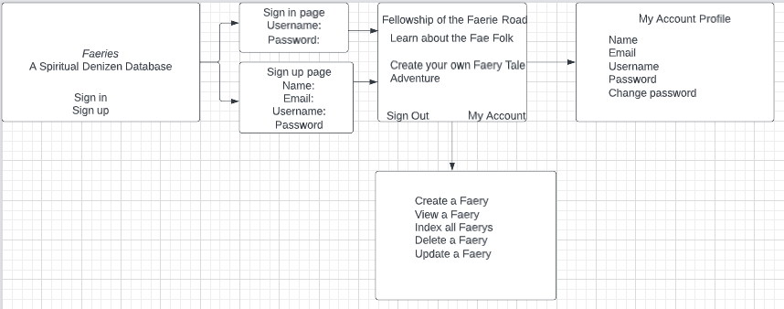

# Faerie Path

# Description 
A website where users can create their own faeries with unique faerie powers!
Click here to explore: https://rebeccafoltin.github.io/faerie-path-react-front/

## Introduction
Ever dreamed of making your own faeries? 

Welcome to Faerie Path, a Database for Spiritual Denizens! Faeriepath is an app that allows users to create, read, update, and delete their 'faerie' resources. Faerie resources include faerie names and faerie powers. The website uses React as a front-end framework, MongoDb as a database, and express and node as back-end frameworks. 

## Set Up Instructions
- Fork and clone this repository
- Change into directory
- Checkout to a new branch
- Run ``npm install`` in the command line
- Run ``npm start`` in the command line

## Project Planning 
-

## User Stories
1. Sign Up: If you are new, welcome! Please sign up with your email and password.
2. Sign In: If you have an account, click sign in. Change your password if needed.

- User can sign up.
- User can sign in, sign out, and change password.
- User can create a faerie resource
- User can read a faerie resource
- User can index faerie resources
- User can update a faerie resource
- User can delete a faerie resource

## API Routes
### _Profile Routes_

| HTTP Method   | URL Path        | Result               | Action           |
|:--------------|:----------------|:---------------------|:-----------------|
| GET           | /profiles       | read list of profiles| index or list    |
| GET           | /profiles/`:id` | read single profile  | show or retrieve |
| POST          | /profile        | create profile       | create           |
| PATCH         | /profiles/`:id` | update profile       | update           |
| DELETE        | /profiles/`:id` | delete profile       | destroy          |

## Technologies Used

|    Libraries      | Languages        | Frameworks              | Database          | Version Control
|:-----------------------------------------|:----------------|:---------------------|:-----------------|:-----------------|
| [React.js](https://reactjs.org/)       |    [HTML](https://developer.mozilla.org/en-US/docs/Web/HTML)        |  [Express](https://expressjs.com/) | [MongoDB](https://www.mongodb.com/)   | [GitHub](https://github.com/) |[Javascript](https://www.javascript.com/)          | [BootStrap](https://getbootstrap.com/)       |           |
|  [Axios](https://www.npmjs.com/package/axios)         | [CSS](https://developer.mozilla.org/en-US/docs/Web/CSS)          |        |          |
|    [Mongoose](https://mongoosejs.com/)        |           |        |         |
|          |          |       |         |

### Entity Relationship Diagram

https://photos.app.goo.gl/kfqDrzZewNQJpDJD8 

### Wireframe

https://photos.app.goo.gl/PkeRm6bAVtC3w9aRA

### Opportunities for Future Iterations
I plan on spending the summer Working towards making this a database to share my faerie knowledge with the world. I hope to create an interactive choose your own adventure game with the faeries users create

### [Link to Back End Repo](https://github.com/rebeccafoltin/express-api-faerie)
#### [Link to Front End Repo](https://github.com/rebeccafoltin/faerie-path-react-front)

### Links to Deployed Sites:
- [Link to the API Deployed](https://stormy-fortress-08010.herokuapp.com/)
- [Link to the Client Deployed](https://rebeccafoltin.github.io/faerie-path-react-front/)